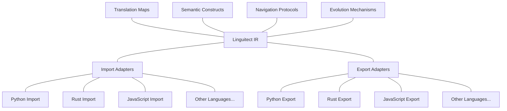
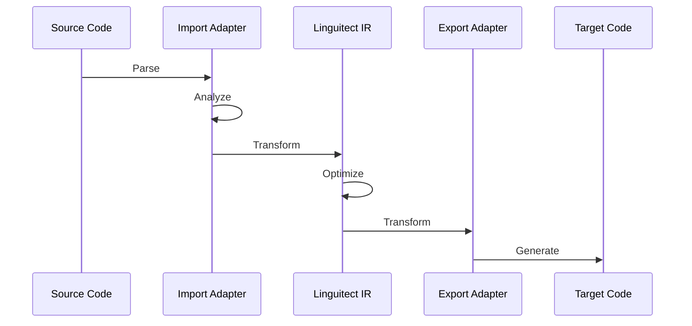

# Linguitect

An LLM-powered programming language translator that bridges the gap between different programming languages through a semantic-focused intermediate representation.

## Overview

Linguitect is an intermediate representation (IR) language designed specifically for translating code between programming languages. Unlike traditional transpilers that focus on syntax, Linguitect captures the semantic intent of code, enabling more accurate translations across different programming paradigms.

The project addresses a fundamental challenge in software development: the need to translate code between languages while preserving its meaning and intent. By focusing on what code does rather than how it's written, Linguitect enables developers to:

- Convert legacy codebases to modern languages
- Share algorithms across language boundaries
- Learn new languages by seeing familiar code translated
- Bridge different programming paradigms (OOP, functional, procedural)



## Key Features

### Semantic-Focused Translation
Linguitect captures what code does rather than how it's written, preserving programmer intent across language boundaries. This approach enables more accurate translations, especially when moving between languages with different paradigms or features.

### Paradigm Neutrality
The intermediate representation supports multiple programming paradigms (procedural, object-oriented, functional) without bias, allowing for effective translation between languages that emphasize different paradigms.

### Self-Documenting Representation
Linguitect uses verbose, explicit tags that make structure obvious, enhancing readability for both humans and machines:

```
@FUNC calculate_total(items) -> int
  @DOCS "Calculate the sum of all items in the list"
  @BODY
    @VAR total int = 0
    @LOOP type="for" var=item in=items
      @ASSIGN total <- @EXPR_ARITHMETIC type="+" operands=(total, item)
    @ENDLOOP
    @RETURN total
  @END
@ENDFUNC
```

### Extensible Language Support
The hub-and-spoke architecture allows for adding new languages by creating just two adapters (import and export), instantly enabling translation to/from all existing supported languages.

### Emoji-Based Ultra-Condensed Representation
For efficient processing, Linguitect offers an emoji-based representation that condenses complex constructs into single characters:

```
🔧calculate_total(items)→🔢{
  📝📝"Calculate the sum of all items in the list"
  📦{
    📝total,🔢=0
    🔁item:items{
      ←total=➕(total,item)
    }
    🔙total
  }
}
```

## Architecture

Linguitect uses a hub-and-spoke architecture with the Linguitect Intermediate Representation (IR) at its center. This design enables efficient multi-language code translation through a common semantic representation.

### Core Components

1. **Linguitect Intermediate Representation (IR)**
   - The central component that serves as the hub for all translations
   - Represents code semantics rather than syntax
   - Uses explicit tagging for clear structure

2. **Language Adapters**
   - **Import Adapters**: Convert source language code to Linguitect IR
   - **Export Adapters**: Convert Linguitect IR to target language code

3. **Semantic Constructs**
   - Define core programming concepts represented in Linguitect
   - Organized by programming paradigm
   - Provide cross-language implementation examples

4. **Translation Maps**
   - Provide guidance for mapping between languages and paradigms
   - Cross-paradigm translation strategies
   - Idiomatic pattern equivalents

5. **Navigation Protocols**
   - Define processes for navigating the translation space
   - Construct translation protocols
   - Idiom translation protocols

### Translation Flow



## Project Structure

The Linguitect repository is organized into the following key directories:

- **`spec/`**: Detailed specifications for the Linguitect IR and emoji representation
- **`language-adapters/`**: Implementation of language-specific adapters
- **`context-network/`**: Comprehensive documentation organized as a knowledge network
  - **`foundation/`**: Core concepts, architecture, and principles
  - **`semantic-constructs/`**: Programming constructs and their representations
  - **`language-adapters/`**: Language-specific adapter documentation
  - **`translation-maps/`**: Cross-language and cross-paradigm translation guidance
  - **`navigation-protocols/`**: Processes for navigating the translation space
  - **`evolution-mechanisms/`**: Processes for adapting and expanding the system

## Getting Started

### Prerequisites

- Node.js v16+
- Python 3.8+ (for Python adapter)
- Rust 1.56+ (for Rust adapter)

### Installation

```bash
# Clone the repository
git clone https://github.com/jwynia/linguitect.git
cd linguitect

# Install dependencies
npm install
```

### Basic Usage

```javascript
const linguitect = require('linguitect');

// Translate Python to JavaScript
const pythonCode = `
def calculate_total(items):
    total = 0
    for item in items:
        total += item
    return total
`;

const jsCode = linguitect.translate(pythonCode, 'python', 'javascript');
console.log(jsCode);
```

## Documentation

Comprehensive documentation is available in the `context-network` directory, organized as a knowledge network designed for efficient navigation by both humans and LLM agents.

### Context Network Structure

The documentation follows a consistent metadata structure:

```markdown
# Document Title

## Purpose Statement
[Concise explanation of this document's function]

## Information Classification
- **Domain:** [Primary knowledge domain]
- **Stability:** [Static/Semi-stable/Dynamic]
- **Abstraction:** [Conceptual/Procedural/Detailed]
- **Confidence:** [Established/Evolving/Speculative]
- **Relevance:** [Primary use contexts]

## Core Content
[Primary information organized in a structured format]

## Relationship Network
- **Prerequisite Information:** [Documents that should be understood first]
- **Related Information:** [Documents with associative connections]
- **Dependent Information:** [Documents that build on this information]
- **Alternative Perspectives:** [Documents with different viewpoints]
- **Implementation Details:** [Documents with more specific information]

## Navigation Guidance
- **Access Context:** [When to use this information]
- **Common Next Steps:** [Typical navigation paths from here]
- **Related Tasks:** [Activities where this information is relevant]
- **Update Patterns:** [How and when this information changes]
```

### Navigation Guide

1. Start with `context-network/foundation/linguitect-core.md` for core concepts
2. Explore `context-network/foundation/architecture.md` for system structure
3. Dive into `context-network/semantic-constructs/` for programming constructs
4. Review `context-network/language-adapters/` for language-specific implementations

## Language Support

### Currently Supported Languages

- Python (import/export)
- Rust (import/export)
- JavaScript (partial support)

### Adding Support for New Languages

To add support for a new language:

1. Follow the guide in `language-adapters/guide-to-making-language-adapters.md`
2. Create import and export adapters for the language
3. Document language-specific constructs and idioms
4. Register any emoji extensions for the language

## Contributing

Contributions are welcome! Please check out our contribution guidelines:

1. Fork the repository
2. Create a feature branch (`git checkout -b feature/amazing-feature`)
3. Commit your changes (`git commit -m 'Add some amazing feature'`)
4. Push to the branch (`git push origin feature/amazing-feature`)
5. Open a Pull Request

### Development Setup

```bash
# Clone the repository
git clone https://github.com/jwynia/linguitect.git
cd linguitect

# Install dependencies
npm install

# Run tests
npm test
```

### Reporting Issues

Please report issues using the GitHub issue tracker, providing:
- A clear description of the issue
- Steps to reproduce
- Expected vs. actual behavior
- Code samples if applicable

## License

This project is licensed under the MIT License - see the [LICENSE](LICENSE) file for details.

```
MIT License

Copyright (c) 2025 J Wynia

Permission is hereby granted, free of charge, to any person obtaining a copy
of this software and associated documentation files (the "Software"), to deal
in the Software without restriction, including without limitation the rights
to use, copy, modify, merge, publish, distribute, sublicense, and/or sell
copies of the Software, and to permit persons to whom the Software is
furnished to do so, subject to the following conditions:

The above copyright notice and this permission notice shall be included in all
copies or substantial portions of the Software.
```

## Acknowledgments

- The project draws inspiration from intermediate representations used in compiler design
- Special thanks to the open-source community for their contributions and feedback
- Emoji representation inspired by APL and other symbolic programming languages
