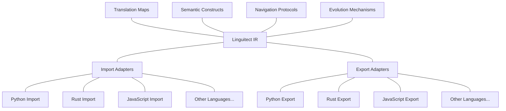
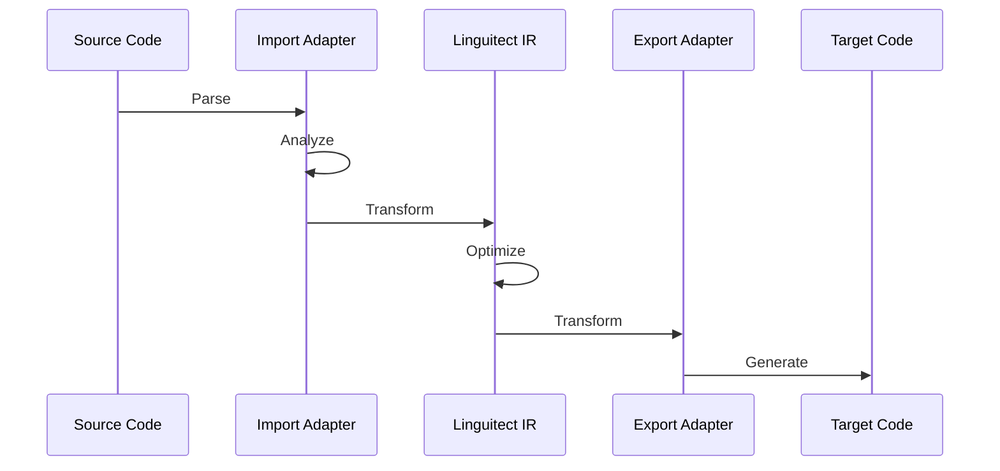

# Linguitect Architecture

## Purpose Statement
This document describes the system architecture and component relationships of the Linguitect project, providing a structural overview of how the various parts interact.

## Information Classification
- **Domain:** Foundation
- **Stability:** High
- **Abstraction:** Conceptual/Structural
- **Confidence:** Established
- **Relevance:** System understanding, implementation guidance

## Core Content

### System Overview

The Linguitect system is architected as a hub-and-spoke translation framework with the Linguitect Intermediate Representation (IR) at its center. This architecture enables efficient multi-language code translation through a common semantic representation.

### Core Components

#### 1. Linguitect Intermediate Representation (IR)

The central component that serves as the hub for all translations. The IR:
- Represents code semantics rather than syntax
- Is paradigm-neutral to support multiple programming approaches
- Uses explicit tagging for clear structure
- Supports rich metadata and annotations

#### 2. Language Adapters

Bridge components that connect specific programming languages to the Linguitect IR:

**Import Adapters**:
- Parse source language code
- Analyze semantics and infer types
- Transform to Linguitect IR
- Recognize language-specific idioms

**Export Adapters**:
- Transform Linguitect IR to target language
- Apply language-specific optimizations
- Generate idiomatic code
- Handle language-specific constraints

#### 3. Semantic Constructs

Define the core programming concepts represented in Linguitect:
- Organized by programming paradigm
- Document semantic intent
- Provide cross-language implementation examples
- Define translation guidance

#### 4. Translation Maps

Provide guidance for mapping between languages and paradigms:
- Cross-paradigm translation strategies
- Idiomatic pattern equivalents
- Domain-specific translation approaches

#### 5. Navigation Protocols

Define processes for navigating the translation space:
- Construct translation protocols
- Idiom translation protocols
- Paradigm bridging protocols
- Performance optimization protocols

#### 6. Evolution Mechanisms

Provide processes for adapting and expanding the system:
- Evaluation metrics
- Refinement processes
- Expansion processes
- Governance mechanisms

### Component Interactions

#### Translation Flow

The standard translation flow follows these steps:

1. **Source Code Parsing**: Import adapter parses source code into an AST
2. **Semantic Analysis**: Import adapter analyzes the AST for semantics
3. **IR Generation**: Import adapter transforms the analyzed AST to Linguitect IR
4. **IR Optimization**: Optional optimization of the IR for the target language
5. **Target Code Generation**: Export adapter generates target language code

#### Adapter Development Flow

The process for creating new language adapters:

1. **Language Analysis**: Understand the language's features and paradigms
2. **Semantic Mapping**: Map language constructs to Linguitect semantic constructs
3. **Adapter Implementation**: Create import and export adapters
4. **Testing**: Validate translation quality with test cases
5. **Refinement**: Improve adapter based on evaluation metrics

### Extension Points

The architecture supports several extension points:

1. **New Language Support**: Add new languages by creating import and export adapters
2. **Enhanced Semantic Constructs**: Extend the IR with new programming concepts
3. **Specialized Translation Maps**: Add domain-specific translation guidance
4. **Custom Optimization Passes**: Implement IR optimizations for specific scenarios
5. **Tooling Integration**: Connect with IDEs, build systems, and other tools

## Relationship Network
- **Prerequisite Information:** [linguitect-core.md](./linguitect-core.md)
- **Related Information:** [design-principles.md](./design-principles.md), [terminology.md](./terminology.md)
- **Dependent Information:** [../language-adapters/adapter-template/adapter-structure.md](../language-adapters/adapter-template/adapter-structure.md)
- **Alternative Perspectives:** None
- **Implementation Details:** External: [spec/linguitect-spec.md]

## Navigation Guidance
- **Access Context:** System understanding, implementation planning
- **Common Next Steps:** Explore [../semantic-constructs/](../semantic-constructs/) for programming constructs, [../language-adapters/](../language-adapters/) for language-specific implementations, or [../translation-maps/](../translation-maps/) for translation strategies
- **Related Tasks:** Designing new adapters, understanding translation flow, planning system extensions
- **Update Patterns:** Updates with major architectural changes or new component additions