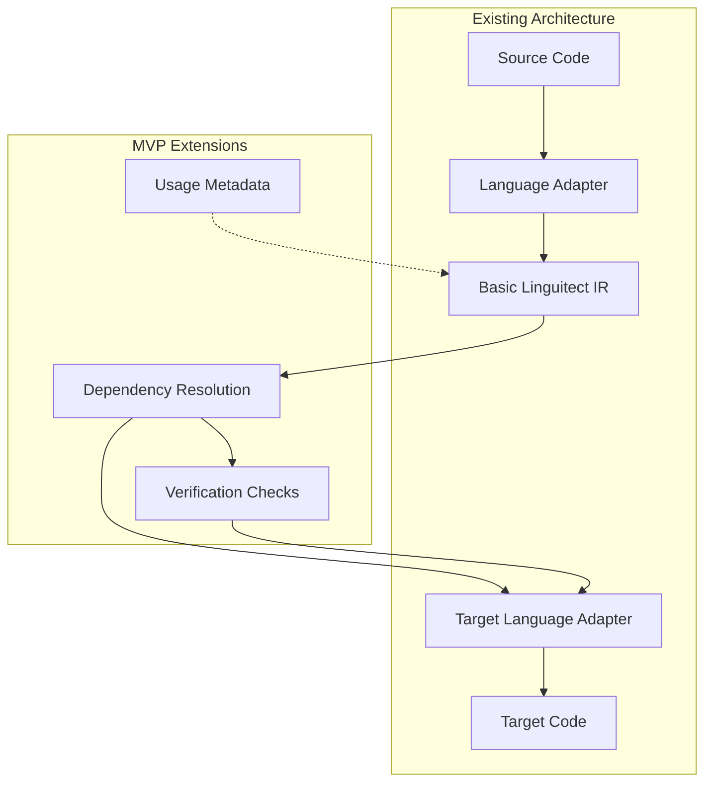

# Minimal Viable Implementation for Dependency Handling

## Purpose Statement
This document outlines a minimal viable implementation approach for enhancing Linguitect's import and dependency handling capabilities, focusing on practical first steps that provide immediate value while laying the groundwork for more advanced features.

## Information Classification
- **Domain:** Translation Process, Dependency Management
- **Stability:** Evolving
- **Abstraction:** Detailed
- **Confidence:** Speculative
- **Relevance:** Implementation planning, initial development, architectural integration

## MVP Scope and Approach

### Core Principles for the MVP

1. **Start Small and Focused**: Begin with a limited scope that addresses the most common use cases
2. **Build on Existing Infrastructure**: Leverage the current Linguitect architecture without major refactoring
3. **Prioritize High-Value Features**: Focus on features that provide immediate value to users
4. **Design for Extensibility**: Create a foundation that can be expanded upon in future iterations
5. **Minimize Maintenance Burden**: Avoid solutions that require extensive ongoing maintenance

### MVP Feature Set

The minimal viable implementation should include:

1. **Basic Import Usage Tracking**
   - Track which specific functions, classes, and constants are used from each import
   - Annotate the IR with this usage information

2. **Standard Library Mapping for Core Functions**
   - Create mappings for the most commonly used standard library functions
   - Focus on Python, JavaScript, and Rust as initial languages
   - Cover basic operations like string manipulation, collections, file I/O

3. **Simple Dependency Resolution Options**
   - Provide basic options for resolving dependencies (use standard library, use equivalent package)
   - Include minimal metadata about compatibility

4. **Basic Verification for Interface Compatibility**
   - Implement simple checks for function signature compatibility
   - Flag potential issues for manual review

## Implementation Details

### 1. Enhanced Import Metadata (Simplified Version)

Extend the Linguitect IR with a simplified version of the import metadata:

```
@IMPORT module [AS alias] [FROM source]
  @USAGE
    @FUNCTIONS func1, func2, ...
    @CLASSES class1, class2, ...
    @CONSTANTS const1, const2, ...
  @END
@END
```

This minimal enhancement:
- Tracks which parts of the imported module are actually used
- Doesn't attempt to capture full contracts or behavior
- Can be automatically generated during the translation process

#### Implementation Steps:

1. Update the Linguitect IR specification to include this simplified metadata
2. Modify the import/export adapters to extract and preserve usage information
3. Implement a simple static analysis tool for each supported language to identify usage

### 2. Core Standard Library Mapping

Create a focused mapping of core standard library functions:

```
@STDLIB_MAPPING
  @SOURCE_LANGUAGE "Python"
  @TARGET_LANGUAGE "JavaScript"
  
  @FUNCTION
    @SOURCE "len(collection)"
    @TARGET "collection.length"
    @NOTES "Works for arrays and strings, but not for Maps/Sets in JS"
  @END
  
  @FUNCTION
    @SOURCE "str.split(delimiter)"
    @TARGET "str.split(delimiter)"
    @NOTES "Compatible behavior for basic cases"
  @END
  
  // Additional mappings for core functions
@END
```

Focus on approximately 20-30 of the most commonly used functions from each language's standard library.

#### Implementation Steps:

1. Identify the most frequently used standard library functions in each language
2. Create mappings between equivalent functions
3. Document any behavioral differences or limitations
4. Implement the mapping lookup during the translation process

### 3. Simple Package Equivalence Database

Create a minimal database of package equivalents for the most common external packages:

```
@PACKAGE_EQUIVALENCE
  @SOURCE_PACKAGE "requests" LANGUAGE="Python"
  @TARGET_PACKAGE "axios" LANGUAGE="JavaScript"
  @COMPATIBILITY_LEVEL "partial"
  @COMMON_FUNCTIONS
    @FUNCTION
      @SOURCE "requests.get(url, params=None, **kwargs)"
      @TARGET "axios.get(url, { params })"
      @NOTES "Basic functionality is similar, but advanced options differ"
    @END
    // Additional function mappings
  @END
@END
```

Start with 5-10 of the most commonly used packages in each language.

#### Implementation Steps:

1. Identify the most commonly used external packages in each language
2. Research and document equivalent packages in target languages
3. Create basic mappings for the most commonly used functions
4. Implement a simple lookup mechanism during translation

### 4. Basic Verification Checks

Implement simple verification checks that focus on interface compatibility:

```
@VERIFICATION_CHECK
  @TYPE "parameter_count"
  @DESCRIPTION "Checks if the number of parameters matches between source and target functions"
  @SEVERITY "warning"
@END

@VERIFICATION_CHECK
  @TYPE "return_value_usage"
  @DESCRIPTION "Checks if the return value is used consistently"
  @SEVERITY "warning"
@END

// Additional basic checks
```

Focus on checks that can be implemented with high reliability and low false positive rates.

#### Implementation Steps:

1. Implement basic signature compatibility checks
2. Create a simple verification report format
3. Integrate verification into the translation process
4. Provide clear warnings for potential issues

## Integration with Linguitect Architecture

### Architectural Touchpoints

The MVP implementation will integrate with the existing Linguitect architecture at several key points:

1. **IR Enhancement**: Extending the Intermediate Representation to include usage metadata
2. **Language Adapter Extensions**: Enhancing language adapters to extract and utilize dependency information
3. **Translation Process Augmentation**: Adding dependency resolution and verification steps to the translation process



### Integration Points

1. **IR Specification Extension**:
   - Add the simplified `@USAGE` section to import declarations
   - Ensure backward compatibility with existing IR

2. **Language Adapter Enhancement**:
   - Extend import adapters to extract usage information
   - Update export adapters to utilize dependency resolution information

3. **Translation Process Flow**:
   - Add a dependency resolution step after IR generation
   - Implement verification checks before target code generation
   - Provide feedback on potential issues

4. **Documentation Integration**:
   - Update language adapter documentation to include dependency handling
   - Create guides for extending standard library mappings

## Implementation Roadmap

### Phase 1: Foundation (1-2 months)
1. Extend the IR specification to include usage metadata
2. Implement basic usage tracking in language adapters
3. Create initial standard library mappings for core functions

### Phase 2: Basic Functionality (2-3 months)
1. Implement the package equivalence database structure
2. Add initial mappings for common packages
3. Develop basic verification checks

### Phase 3: Integration and Testing (1-2 months)
1. Integrate all components into the translation process
2. Test with real-world code examples
3. Refine based on feedback and results

## Evaluation Criteria

The MVP implementation should be evaluated based on:

1. **Improvement in Translation Quality**: Does it reduce manual intervention for import handling?
2. **Developer Experience**: Is the feedback clear and actionable?
3. **Performance Impact**: Does it maintain reasonable translation performance?
4. **Extensibility**: Does it provide a solid foundation for future enhancements?

## Future Expansion Paths

The MVP is designed to be extended in several directions:

1. **Enhanced Contract Information**: Add more detailed contract information to imports
2. **Behavioral Verification**: Implement more sophisticated verification of behavioral equivalence
3. **Expanded Coverage**: Increase the number of mapped standard library functions and packages
4. **Automated Analysis**: Develop more sophisticated static and dynamic analysis tools

## Relationship to Broader Linguitect Architecture

The dependency handling MVP relates to the broader Linguitect architecture in several important ways:

### 1. Alignment with Core Design Principles

The MVP approach aligns with Linguitect's core design principles:

- **Self-documenting**: The enhanced IR remains explicit and readable
- **Semantic-focused**: The focus is on capturing what imports are used for, not just syntax
- **Paradigm-neutral**: The approach works across different programming paradigms
- **Intent-preserving**: Usage tracking helps preserve the intent of imports

### 2. Extension of the Translation Pipeline

The MVP extends the existing translation pipeline without disrupting it:

1. **Source Code Analysis** → **IR Generation** → **[New: Dependency Resolution]** → **Target Code Generation**

This maintains the clean separation between language-specific and language-neutral components.

### 3. Complementary to Existing Features

The dependency handling MVP complements existing Linguitect features:

- **Construct Translation**: Provides additional context for translating constructs that use imported functionality
- **Idiom Translation**: Helps identify when imported functionality is part of a larger idiom
- **Error Handling**: Improves translation of error handling related to external dependencies

### 4. Foundation for Future Capabilities

The MVP lays groundwork for future capabilities:

- **Project-Level Translation**: Better dependency handling is essential for translating entire projects
- **Ecosystem Integration**: Provides a path toward integrating with language-specific ecosystems
- **Verification and Testing**: Creates a foundation for more sophisticated verification

## Relationship Network
- **Prerequisite Information:** [dependency-handling-plan.md](./dependency-handling-plan.md), [dependency-handling-challenges.md](./dependency-handling-challenges.md)
- **Related Information:** [../foundation/architecture.md](../foundation/architecture.md), [../navigation-protocols/construct-translation.md](../navigation-protocols/construct-translation.md)
- **Dependent Information:** Language adapter implementation specifications
- **Alternative Perspectives:** None
- **Implementation Details:** [../../language-adapters/guide-to-making-language-adapters.md](../../language-adapters/guide-to-making-language-adapters.md)

## Navigation Guidance
- **Access Context:** When planning initial implementation of dependency handling, prioritizing development efforts, or integrating with existing architecture
- **Common Next Steps:** Review dependency-handling-plan.md for the full vision, explore language adapter documentation for implementation details
- **Related Tasks:** IR specification updates, language adapter enhancements, standard library mapping
- **Update Patterns:** Updates when implementation details are refined or when the MVP scope changes