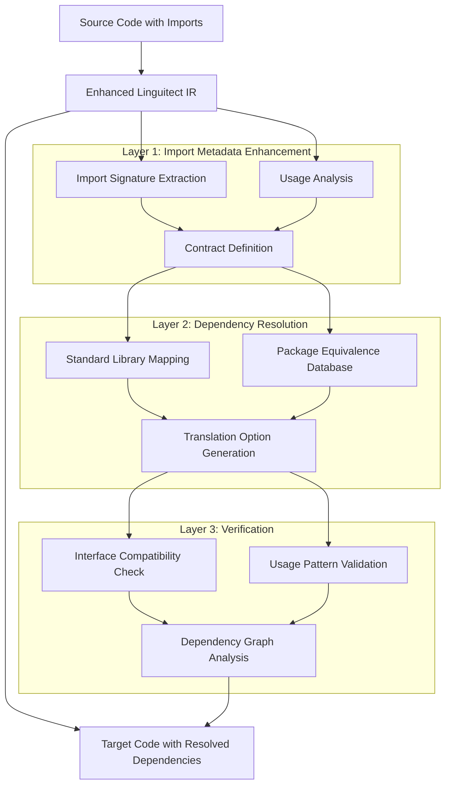

# Enhancing Import and Dependency Handling in Linguitect

## Purpose Statement
This document outlines a comprehensive plan for enhancing Linguitect's import and dependency handling capabilities, focusing on preserving contracts between modules and enabling verification of correct API usage after translation.

## Information Classification
- **Domain:** Translation Process, Dependency Management
- **Stability:** Evolving
- **Abstraction:** Detailed
- **Confidence:** Speculative
- **Relevance:** Cross-language translation, API compatibility, dependency resolution

## Current State Analysis

Based on review of the Linguitect documentation, I've identified the following aspects of the current import/dependency handling:

1. **Basic Import Representation**: The Linguitect IR includes basic import syntax (`@IMPORT module [AS alias] [FROM source]` and `@IMPORT_SYSTEM library`).

2. **Language-Specific Adapters**: Each language adapter includes rules for translating imports to and from the IR.

3. **Standard Library Hints**: Some language adapters include high-level module groups for standard libraries (e.g., Python's collections, itertools, etc.).

4. **Standard Library Mappings**: There's a concept of `@STDLIB_MAPPING` in the language adapters guide, but implementation appears limited.

5. **No Comprehensive External Package Handling**: There doesn't appear to be a systematic way to handle external package dependencies.

## Challenges and Requirements

The key challenges for enhancing import and dependency handling include:

1. **Contract Preservation**: Ensuring that the "contract" or interface of imported modules is preserved during translation.

2. **Translation Options**: Providing options to either use an equivalent package in the target language or translate the imported package itself.

3. **Verification**: Enabling verification that the translated code correctly uses the target language's equivalent API.

4. **Scope Management**: Keeping translations focused on the current file while maintaining awareness of dependencies.

## Proposed Solution Architecture

I propose a three-layer approach to handling imports and dependencies:



### Layer 1: Import Metadata Enhancement

Enhance the Linguitect IR to include more detailed information about imports:

```
@IMPORT module [AS alias] [FROM source]
  @USAGE
    @FUNCTIONS func1, func2, ...
    @CLASSES class1, class2, ...
    @CONSTANTS const1, const2, ...
  @END
  
  @CONTRACT
    @FUNCTION func1(param1: type1, param2: type2) -> return_type
      @BEHAVIOR "Description of function behavior"
      @SIDE_EFFECTS "Any side effects"
    @END
    
    @CLASS class1
      @METHOD method1(param1: type1) -> return_type
      @PROPERTY prop1: type
    @END
  @END
@END
```

This enhancement would:
- Document which parts of the imported module are actually used
- Define the "contract" or interface expected from the imported module
- Provide semantic information about the behavior of imported functions/classes

### Layer 2: Dependency Resolution

Create a dependency resolution system that:

1. **Maps Standard Library Functions**:
   - Maintain a database of standard library function equivalents across languages
   - Focus on commonly used functions first, with the ability to expand

2. **Handles External Packages**:
   - Create a database of common package equivalents (e.g., Python's requests → JavaScript's axios)
   - Define the level of compatibility between packages (full, partial, wrapper-required)

3. **Generates Translation Options**:
   - For each import, generate options:
     - Use equivalent standard library function
     - Use equivalent package in target language
     - Translate the imported package itself
   - Provide pros/cons for each option

```
@DEPENDENCY_RESOLUTION
  @IMPORT module FROM source
    @OPTIONS
      @OPTION type="standard_library"
        @TARGET_IMPORT target_module FROM target_source
        @COMPATIBILITY level="full|partial|wrapper-required"
        @PROS "Benefits of this option"
        @CONS "Drawbacks of this option"
      @END
      
      @OPTION type="equivalent_package"
        @TARGET_IMPORT target_package FROM target_source
        @COMPATIBILITY level="full|partial|wrapper-required"
        @PROS "Benefits of this option"
        @CONS "Drawbacks of this option"
      @END
      
      @OPTION type="translate_package"
        @TRANSLATION_PATH path/to/package
        @COMPLEXITY level="simple|moderate|complex"
        @PROS "Benefits of this option"
        @CONS "Drawbacks of this option"
      @END
    @END
  @END
@END
```

### Layer 3: Verification

Implement a verification system that:

1. **Checks Interface Compatibility**:
   - Verify that the target language's equivalent provides the required interface
   - Identify any missing or differently-named functions/methods

2. **Validates Usage Patterns**:
   - Ensure that the translated code uses the target API correctly
   - Identify any parameter order differences, naming conventions, etc.

3. **Analyzes Dependency Graph**:
   - Build a graph of dependencies to identify potential conflicts
   - Ensure that all dependencies are resolved consistently

```
@VERIFICATION
  @IMPORT module FROM source
    @TARGET_IMPORT target_module FROM target_source
    
    @INTERFACE_CHECK
      @FUNCTION func1
        @STATUS "compatible|incompatible|partial"
        @ISSUES "Any compatibility issues"
        @WORKAROUND "Suggested workaround if needed"
      @END
    @END
    
    @USAGE_CHECK
      @CALL func1
        @STATUS "correct|incorrect|warning"
        @ISSUES "Any usage issues"
        @CORRECTION "Suggested correction if needed"
      @END
    @END
  @END
@END
```

## Implementation Strategy

I recommend a phased implementation approach:

### Phase 1: Enhanced Import Metadata

1. Extend the Linguitect IR to include detailed import metadata
2. Update language adapters to extract and preserve this metadata
3. Implement usage analysis to identify which parts of imports are actually used

### Phase 2: Standard Library Mapping

1. Create a comprehensive mapping of standard library functions across languages
2. Focus on the most commonly used functions first
3. Implement a mechanism to suggest standard library equivalents

### Phase 3: External Package Handling

1. Develop a database of common package equivalents
2. Implement analysis of package usage to determine compatibility requirements
3. Create a system to generate and present translation options

### Phase 4: Verification System

1. Implement interface compatibility checking
2. Develop usage pattern validation
3. Create dependency graph analysis tools

## Benefits and Challenges

### Benefits

1. **Improved Translation Accuracy**: Better handling of imports will lead to more accurate translations
2. **Clearer Options**: Translators will have clear options for handling dependencies
3. **Verification**: The system will be able to verify that translations maintain the expected contracts
4. **Flexibility**: The approach allows for different strategies depending on the specific import

### Challenges

1. **Complexity**: This is a complex enhancement that touches multiple parts of the system
2. **Maintenance**: The package equivalence database will require ongoing maintenance
3. **Completeness**: Achieving complete coverage of all standard libraries and packages is challenging
4. **Verification Accuracy**: Ensuring accurate verification without false positives/negatives

## Next Steps

1. Enhance the Linguitect IR specification to include the proposed import metadata structure
2. Create a prototype implementation for a limited set of standard library functions
3. Test with simple translations between Python and JavaScript
4. Evaluate the approach and refine based on results

## Relationship Network
- **Prerequisite Information:** [../foundation/linguitect-core.md](../foundation/linguitect-core.md), [../../spec/linguitect-spec.md](../../spec/linguitect-spec.md)
- **Related Information:** [../navigation-protocols/construct-translation.md](../navigation-protocols/construct-translation.md), [../translation-maps/README.md](../translation-maps/README.md)
- **Dependent Information:** Language adapter implementations
- **Alternative Perspectives:** None
- **Implementation Details:** [../../language-adapters/guide-to-making-language-adapters.md](../../language-adapters/guide-to-making-language-adapters.md)

## Navigation Guidance
- **Access Context:** When planning dependency handling improvements, implementing language adapters, or enhancing translation verification
- **Common Next Steps:** Review language adapter documentation, explore standard library mapping implementations
- **Related Tasks:** Language adapter development, translation verification, dependency resolution
- **Update Patterns:** Updates when new dependency handling mechanisms are developed or existing ones are refined